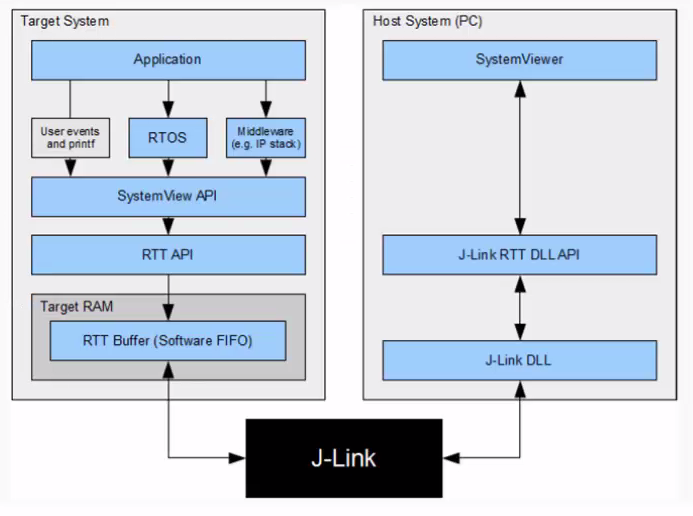
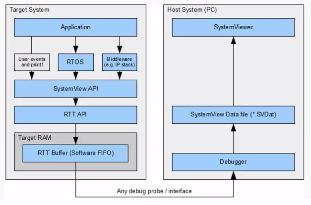

# Course: Mastering RTOS: Hands on FreeRTOS and STM32Fx with Debugging

Notes and Code Author: Leandro D. Medus  
August 2021

## Ch10. 10. FreeRTOS app debugging using SEGGER SystemView Tools


### 10.2. Downloading SEGGER SystemView Software

Download: 
* SEGGER SystemView (windows installer)
* SystemView Target sources 
* Manuals

### 10.3. SEGGER SystemView Installation and first look

Just intalling SystemView_Windows_V330_x64.exe for a fresh install.

### 10.4. What is SEGGER SystemView 

System View is a software toolkit which is used to analyze the embedded software behaviour running on your target.

The embedded software may contain embedded OS or RTOS or it could be non-OS based application.

**The system View can be used to analyze how your embedded code is behaving on the target** 

In the case of a FreeRTOS application:
* You can analyze how many tasks are running and how much duration they consume on the CPU.
* ISR entry and exit timings and duration of run on the CPU.  
* You can analyze other behaviour of tasks: like blocking, unblocking, notifying, yielding, etc.
* You can analyze CPU idle time so that you can think of sending CPU to speed mode
* Total runtime behaviour of the application.


* It sheds light on what exactly happened in which order, which interrupt has triggered which task switch, which interrupt and task has called which API function of the underlying RTOS.
* System View should be used to verify that the embedded system behaves as expected and can be used to find problems and inefficiencies, such as superfluous and spurious interrupts, and unexpected task changes.


#### Toolkit

SystemViewer toolkit come in two parts:
1. PC visualization software: System View Host software (Windows/Linux/mac)
2. System View target codes (this is used to collect the target events and sending back to PC visualization software)


### 10.5. SEGGER SystemView visualization modes

#### 10.5.1 Real time recording (Continuous recording):

With a SEGGER **J-Link** and its Real Time Transfer (RTT) technology System View can continuously record data, and analyze and visualize it in real time.

Real time mode can be achieved via ST-link instead of J-link. For that **J-link firmware has to be flashed on ST-link circuitry of STM32 boards**.



In the custom system two layers have to been included:
* System View API
* RTT API

#### 10.5.2 Single-shot recording

**You need not to have JLINK or STLINK debugger** for this.

In single-shot mode the recording is started manually in the application, which allows recording only specific parts, which are of interest.



When no J-Link is used, SEGGER System View can be used to record data until its target buffer is filled (RTT Buffer). In single-shot mode the recording is started manually in the application, which allows recording only specific parts, which are of interest.

### 10.6. SEGGER SystemView Target integration preparation

For the single-shot recording:
* The applicartion is ready
* The RTOS is included in the project
* So we need to include APIs in our target application


#### STEP 1: Including SEGGER System View in the application

1. Download Systemview target sources and extract it
2. Create the folders as below in your FreeRTOS Project.
```c
Third-Party > SEGGER > <sources>   
```
Folders:
* Config
* OS
* Patch
* SEGGER

Inside Config, place:
* Global.h
* SEGGER_RTT_Conf.h
* SEGGER_SYSVIEW_Conf.h
* SEGGER_SYSVIEW_Confing_FreeRTOS.c

Inside OS, place:
* SEGGER_SYSVIEW_FreeRTOS.c
* SEGGER_SYSVIEW_FreeRTOS.h

Inside Patch, place a new folder with the current version of FreeRTOS: 
* FreeRTOSv10.2.1
And inside place the file:
* FreeRTOSV10_Core.patch

Inside SEGGER, place:
* SEGGER.h
* SEGGER_RTT.c
* SEGGER_RTT.h
* SEGGER_SYSVIEW.c
* SEGGER_SYSVIEW.h
* SEGGER_SYSVIEW_ConfDefaults.h
* SEGGER_SYSVIEW_Int.h

**Note:**  

For the current version I also included:
* folder Syscall (here I kept only the file for GCC)
* SEGGER_RTT_ASM_ARMv7M.S
* SEGGER_RTT_printf.c

3. Do the path settings for the include files of SEGGER in Eclipse

### 10.7. SEGGER SystemView Target integration step by step

Go to the eclipse project, refresh the Third-Party directory and check that the SEGGER subdirectory is not excluded from build (under C7C++ build properties)

```c
project > properties

C/C++ Build > Settings > MCU GCC Compiler > Includes

add workspace :
    * SEGGER/Config
    * SEGGER/OS
    * SEGGER/SEGGER
```

#### STEP 2: Patching FreeRTOS files

You need to patch some of the FreeRTOS files with patch file given by SEGGER system View

right click on FreeRTOS folder (in eclipse)
* Team 
    * Apply patch

> In this case, since I'm using Nucleo-L5 board, which contains a Cortex-M33, a new custom patch file has been created. This file is based in the patch provided by Segger for Cortex-M.

#### STEP3: FreeRTOSConfig.h Settings

1. The SEGGER_SYSVIEW_FreeRTOS.h header has to be included at the end of FreeRTOSConfig.h or above every include of FreeRTOS.h. It defines the trace macros to create SYSTEMVIEW events.

```c
#include "SEGGER_SYSVIEW_FreeRTOS.h"
```

2. In freeRTOSConfig.h include the below macros 
```c
#define INCLUDE_xTaskGetIdle TaskHandle 1 
#define INCLUDE_pxTaskGetStackStart 1   
```

#### STEP4: MCU and Project specific settings

1. Mention which processor core your MCU is using in SEGGER_SYSVIEW_Conf.h
> I omitted this part.

2. Do System View buffer size configuration in SEGGER_SYSVIEW_Conf.h (SEGGER_SYSVIEW_RTT_BUFFER_SIZE).
> Currently in **SEGGER_RTT_Conf.h** and it's called **BUFFER_SIZE_UP**

3. Configure the some of the application specific information in SEGGER_SYSVIEW_Config_FreeRTOS.C

```c
// The application name to be displayed in SystemViewer
#define SYSVIEW_APP_NAME        "FreeRTOS PoC UART Application"

// The target device name
#define SYSVIEW_DEVICE_NAME     "NUCLEO-L552ZE-Q"
```

From the datasheet of the device: Section **3.5 Embedded SRAM**

The devices feature 256 Kbytes of embedded SRAM. This SRAM is split into three blocks (only two are described?):
* 192 Kbytes mapped at address 0x2000 0000 (SRAM1)
* 64 Kbytes located at address 0x0A03 0000 with hardware parity check (SRAM2).
This memory is also mapped at address 0x2003 0000 offering a contiguous address
space with the SRAM1.
This block is accessed through the C-bus for maximum performance. Either 64 Kbytes
or upper 4 Kbytes of SRAM2 can be retained in Standby mode.
The SRAM2 can be write-protected with 1 Kbyte granularity

```c
#define SYSVIEW_RAM_BASE        (0x20000000)
```

#### STEP5: Enable the ARM Cortex Mx Cycle Counter

This is required to maintain the time stamp information of application events. System View will use the Cycle counter register value to maintain the time stamp information of events.

Data Watchpoint and Trace Unit (DWT)

DWT CYCCNT register of ARM Cortex Mx processor stores number of clock cycles that have been happened after the reset of the Processor.

By default this register is disabled.


in the reference manual of ARM cortex M33, section **C3.2 DWT programmers model**

```c
    Address offset  Name        Type    Reset value     Description
    0xE0001004      DWT_CYCCNT  RW      0x00000000      Cycle Count Registe
```

Note:
*DWT registers are described in the Arm®v8-M Architecture Reference Manual. Peripheral Identification and Component Identification registers are described in the CoreSight™ Components Technical Reference Manual*

To enable DWT, in main.c: 

```c
/* USER CODE BEGIN PV */
#define DWT_CTRL    (*(volatile uint32_t*)0xE0001000)

/* USER CODE END PV */
```

Then after the initialization in main()
```c
//Enable the CYCCNT counter.
DWT_CTRL |= ( 1 << 0);
```

#### STEP6: Start the recording of events

1. To start the recordings of your FreeTOS application, call the below SEGGER APIS

* SEGGER_SYSVIEW_Conf(); 
* SEGGER_SYSVIEW_Start();

The segger systemview events recording starts only when you call EGGER_SYSVIEW_Start(). We will call this from main.c

### 10.8. SEGGER SystemView taking FreeRTOS trace using snapshot mode


### 10.9. SEGGER SystemView jlink reflash utility download


### 10.10. SEGGER SystemView taking FreeRTOS trace using Continuous recording


### 10.11. Analyzing the trace  An Overview


### 10.12. Analyzing FreeRTOS helloword application using SystemView Trace


## TODO

in SEGGER_SYSVIEW_Conf.h

```c
#define SEGGER_UART_REC 1

#if (SEGGER_UART_REC == 1)
	extern void HIF_UART_EnableTXEInterrupt  (void);
	#define SEGGER_SYSVIEW_ON_EVENT_RECORDED(x)  HIF_UART_EnableTXEInterrupt()
#endif
```