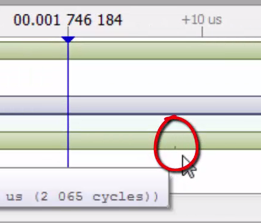

# Course: Mastering RTOS: Hands on FreeRTOS and STM32Fx with Debugging

Notes and Code Author: Leandro D. Medus  
August 2021

## Ch11. IDLE Task and Timer Svc Task of FreerRTOS

### 11.1. IDLE task and its significance

The Idle task is created automatically when the RTOS scheduler is started to ensure there is always at least one task that is able to run.

It is created at the lowest possible priority to ensure it does not use any CPU time if there are higher priority application tasks in the ready state.

#### Some facts about Idle Task


* It is a lowest priority task which is automatically created when the scheduler is started
* **The idle task is responsible for freeing memory allocated by the RTOS to tasks that have been deleted**
* When there are no tasks running, Idle task will always run on the CPU.
* You can give an application **hook function in the idle task to send the CPU to low power mode** when there are no useful tasks are executing.


#### Idle Task hook function

* Idle task hook function implements a callback from idle task to your application
* You have to enable the idle task hook function feature by setting this config item **configUSE_TICK_HOOK to 1** within **FreeRTOSConfig.h**
* Then implement the below function in your application 
```c
   void vApplicationIdleHook(void);
```
* That's it, whenever idle task is allowed to run, your hook function will get called, where you can do some useful stuffs like sending the MCU to lower mode to save power

### 11.2. FreeRTOS Timer Services task and other details

#### Timer Services Task (Timer_svc)

* This is also called as timer daemon task
* The timer daemon task deals with "Software timers"
* This task is created automatically when the scheduler is started and if **configUSE_TIMERS = 1** in **FreeRTOSConfig.h**
* The RTOS uses this daemon to manage FreeRTOS software timers and nothing else.
* If you don't use software timers in your FreeRTOS application then you need to use this Timer daemon task. For that just make **configUSE_TIMERS = 0** in FreeRTOSConfig.h
* All software timer callback functions execute in the context of the timer daemon task


this signal corresponds to the **Tmr Svc** task and the small mark indicates the execution of a FreeRTOS API:


**Note:** In my current version of SeggerViewer this small tick in the signal corresponding to \[Context: Tmr Svc, Event: vTaskDelayUntil\] is not present.

