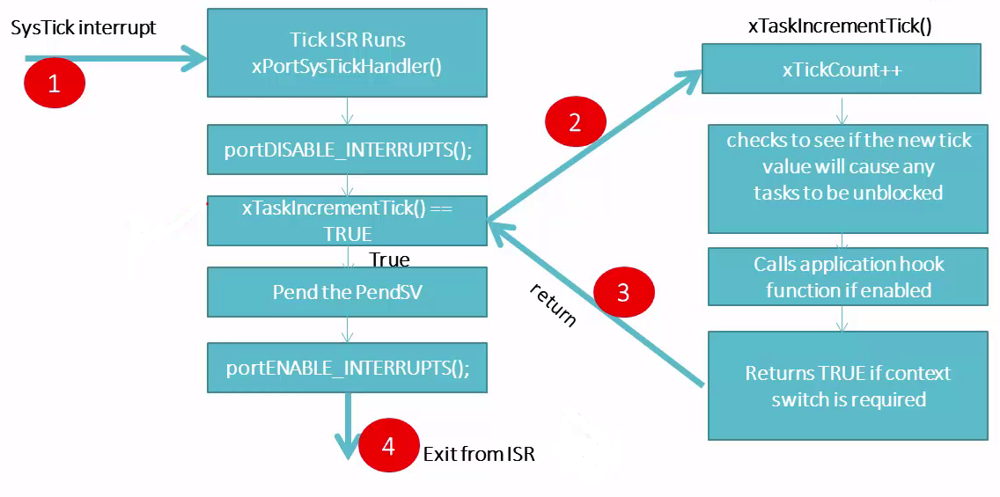

# Course: Mastering RTOS: Hands on FreeRTOS and STM32Fx with Debugging

Notes and Code Author: Leandro D. Medus  
August 2021

## Ch13. FreeRTOS and ARM Cortex Mx Arch. Specific details

### 13.1. FreeRTOS Kernel interrupts


When FreeRTOS runs on ARM Cortex Mx Processor based MCU, the below interrupts are used to implement the Scheduling of Tasks.

1. **SVC Interrupt** (SVC handler will be used to launch the very first Task )

2. **PendSV Interrupt** (PendSV handler is used to carry out context switching between tasks)

3. **SysTick Interrupt** (SysTick Handler implements the RTOS Tick Management)

* If SysTick interrupt is used for some other purpose in your application, then you may use any other available timer peripheral
* All interrupts are configured at the lowest interrupt priority possible.


### 13.2. RTOS Tick and SysTick Timer explanation

**RTOS Ticking is implemented using timer hardware of the MCU**

* Architecture ARM CORTEX M
    * Atmel SAMxx AT91SAM3X8E
    * STM ST32Fxx
    * LPC LPCxx
    * another manufacture family

> All of them call **SysTick Timer**

#### The RTOS Tick- Why it is needed?

* The simple answer is to keep track of time elapsed
* There is a global variable called "**xTickCount**", and it is incremented by one whenever tick interrupt occurs
* RTOS Ticking is implemented using SysTick timer of the ARM Cortex Mx processor.
* Tick interrupt happens at the rate of **configTICK_RATE_HZ** configured in the **FreeRTOSConfig.h**

#### The RTOS Tick- 

**Used for Context Switching to the next potential Task**

* Each timer Tick interrupt makes scheduler to run

1. The tick ISR runs
2. All the ready state tasks are scanned
3. Determines which is the next potential task to run
4. If found, triggers the context switching by pending the PendSV interrupt
5. The PendSV handler takes care of switching out of old task and switching in of new task

> Pending an interrupt also means "Activating" that interrupt.
> PendingSV is a system exception which can be triggered by enabling its pending bit in the corresponding register of the ARM Cortex Mx processor. 
Example: 
```c
   portNVIC_INT_CTRL_REG = portNVIC_PENDSVSET_BIT;
```

### 13.3. Who configures the RTOS Tick Timer 


* tasks.c: vTaskStartScheduler()
    * port.c: xPortStartScheduler()
        * First initialize the Sys tick interrupt priority to be lowest possible
        ```c
            /* Make PendSV, CallSV and SysTick the same priority as the kernel. */
            portNVIC_SYSPRI2_REG |= portNVIC_PENDSV_PRI;
            portNVIC_SYSPRI2_REG |= portNVIC_SYSTICK_PRI;
        ```
        * Loads the rate value to SMSTicktimer (configTICK_RATE_HZ)
        * Enables the Systick timer interrupt and starts the timer

#### The RTOS Tick Configuration

* configSYSTICK_CLOCK_HZ= configCPU_CLK_HZ
* If configCPU_CLK_HZ = 16000000 (i.e 16Mhz)
* And configTICK_RATE_HZ = 1000Hz.
* Then portSYSTICK_NVIC_LOAD_REG = (16000000/1000)-1 = 15999
* So, the SysTick timer should count from 0 to 15999 for every 1ms. to generate an interrupt

### 13.4. What RTOS Tick ISR (SysTick ISR) does  summary


