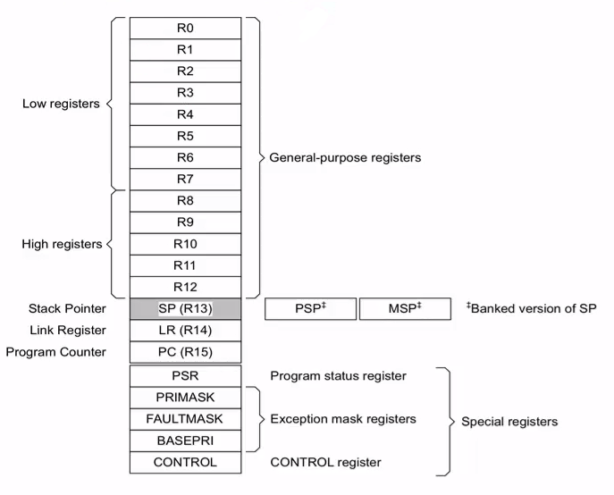
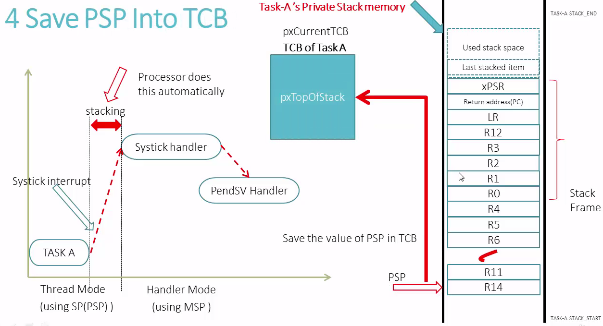

# Course: Mastering RTOS: Hands on FreeRTOS and STM32Fx with Debugging

Notes and Code Author: Leandro D. Medus  
August 2021

## Ch14. Context switching

### 14.1. Introduction to context switching

#### What is Context Switching?

* Context switching is a process of switching out of one task and switching in of another task on the CPU to execute.
* In RTOS, Context Switching is taken care by the Scheduler.
* In FreeRTOS Context Switching is taken care by the **PendSV Handler** found in **port.c**
* Whether context switch should happen or not depends upon the scheduling policy of the scheduler.


* If the scheduler is priority based pre-emptive scheduler, then for every RTOS tick interrupt, the scheduler will compare the priority of the running task with the priority of ready tasks list. If there is any ready task whose priority is higher than the running task then context switch will occur.
* On FreeRTOS you can also trigger context switch manually using **taskYIELD()** macro
* Context switch also happens immediately whenever new task unblocks and if its priority is higher than the currently running task.

in main:
```c
taskYIELD();
```

in task.h
```cpp
#define taskYIELD()     portYIELD()
```

in portmacro.h
```cpp
/* Scheduler utilities. */
#define portYIELD()     vPortYield()
```

in port.c
```c
void vPortYield( void ) /* PRIVILEGED_FUNCTION */
{
	/* Set a PendSV to request a context switch. */
	portNVIC_INT_CTRL_REG = portNVIC_PENDSVSET_BIT;

	/* Barriers are normally not required but do ensure the code is
	 * completely within the specified behaviour for the architecture. */
	__asm volatile( "dsb" ::: "memory" );
	__asm volatile( "isb" );
}
```

#### Task State

When a task executes on the Processor it utilizes

* Processor core registers.
*  If a Task wants to do any push and pop operations (during function call) then it uses its own dedicated stack memory.


```
State of the task = Contents of the processor core registers  + Stack contents
```

### 14.2. Context Switching  understanding State of a Task

#### ARM Cortex Mx Core Registers



Pointers for stack operation:
* **PSP**: process stack pointer (user tasks)
* **MSP**: main stack pointer (kernel tasks)

In FreeRTOS each user task will have it private stack, so tasks use PSP, whereas kernel uses MSP.

There are mainly two different Stack Memories during run time of FreeRTOS based application:
* Task's private stack (process stack)
* Kernel Stack (Main stack)

* when a **task** exceutes, it does PUSH and POP in the **Process Stack** using the **SP(PSP)**
* when a **ISR** exceutes, it does PUSH and POP in the **Main Stack** using the **SP(MSP)**


#### Stacks


Remember:


### 14.3. Context Switching: Task Switching OUT procedure with animation

#### Task switching out procedure

Before task is switched out, following things have to be taken care.

1. Processor core registers RO, R1, R2, R3, R12, LR, PC, xPSR(stack frame) are saved on to the task's private stack automatically by the processor **SysTick interrupt entry sequence**.

2. If Context Switch is required then SysTick timer will pend the PendSV Exception and PendSV handler runs

3. Processor core registers (R4-R11, R14) have to be saved manually on the task's private stack memory (**Saving the context**)

4. Save the new top of stack value (PSP) into first member of the TCB

5. Select the next potential Task to execute on the CPU. Taken care by **vTaskSwitchContext()** implemented in **tasks.c**

```c
/* Select a new task to run using either the generic C or port optimised asm code. */ 
taskSELECT_HIGHEST_PRIORITY_TASK();   
```





### 14.4. Context switching: understanding pendSV handler code (Task Switching In Procedure)

*Explanation of the assembly code of:*
```c
void PendSV_Handler( void ) /* __attribute__ (( naked )) PRIVILEGED_FUNCTION */
```

#### Task Switching In Procedure

So, at this time, we already know which task (TCB) should be switched in.That means new switchable task's TCB can be accessed by **pxCurrentTCB**.

1. First get the address of top of stack. Copy the value of **pxTopOfStack** in to **PSP register**.
2. Pop all the registers (R4-R11, R14) **(Restoring the context)**
3. Exception exit : Now PSP is pointing to the start address of the stack frame which will be popped out automatically due to exception exit.


### 14.5. Understanding SystemView trace when preemption is off

