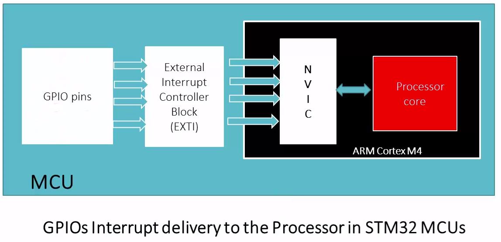
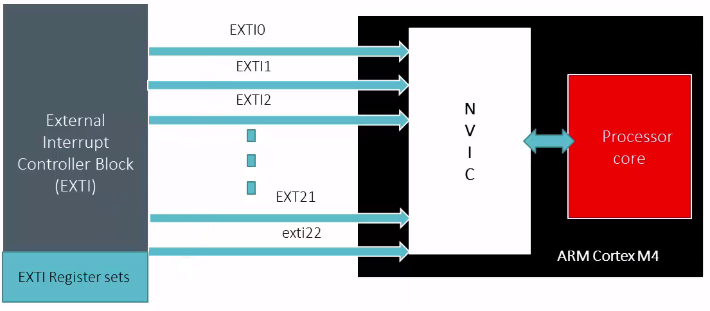
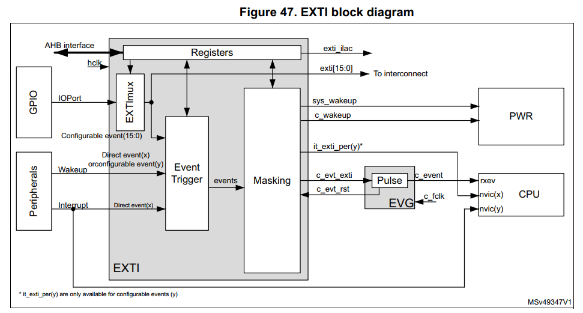
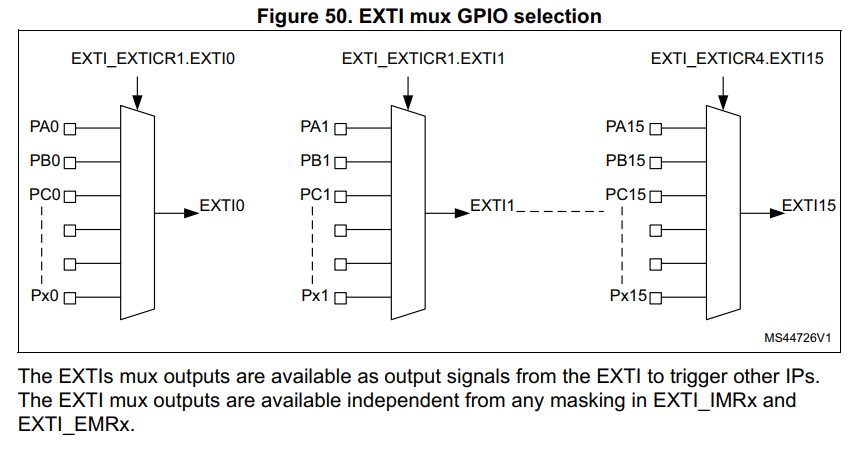
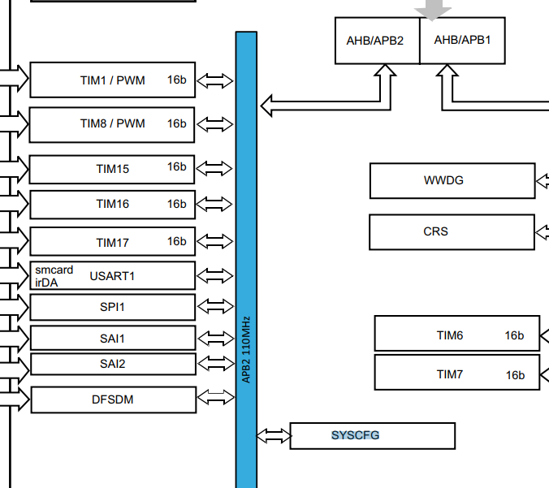
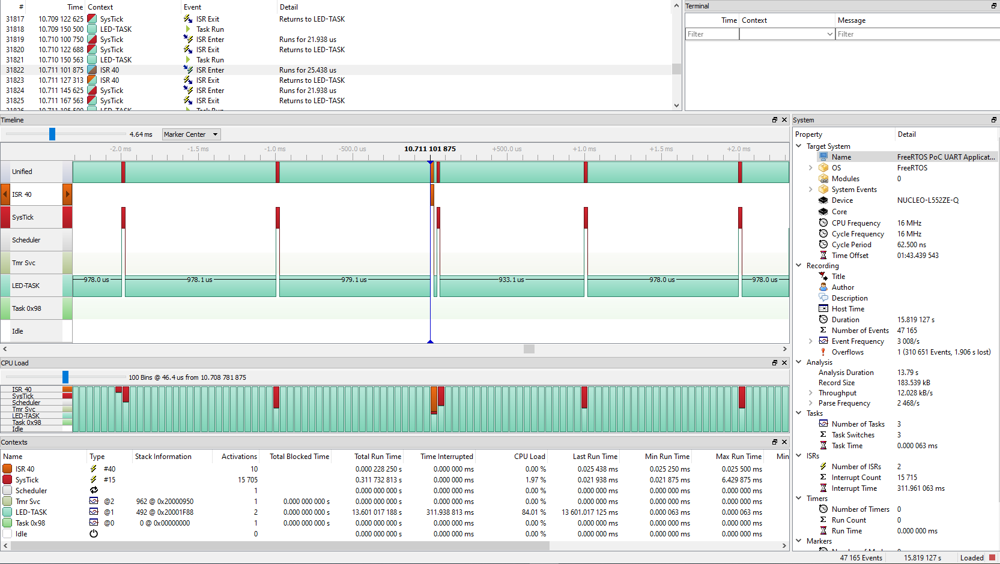

# Course: Mastering RTOS: Hands on FreeRTOS and STM32Fx with Debugging

Notes and Code Author: Leandro D. Medus  
August 2021

## Ch15. Exercise  Button and LED Task and Interrupt Coding

### 15.1. Exercise  Button and LED task

#### Exercise 001

Create 2 Tasks in your FreeRTOS application led_task and button_task.

Button Task should continuously poll the button status of the board and if pressed it should update the flag variable.

Led Task should turn on the LED if button flag is SET, otherwise it should turn off the LED. Use same freeRTOS task priorities for both the tasks.


#### nucleo-F4
On nucleo-F446RE board the LED is connected to PA5 pin and button is connected to PC13


### 15.7. Exercise  working with task and interrupt

#### Exercise 002

Write a FreeRTOS application which creates only 1 task : led_task and it should toggle the led when you press the button by checking the button status flag.

The button interrupt handler must update the button status flag.

### 15.8. Understanding GPIO Interrupts delivery in STM32 MCUs

#### configuring the interrupt in the Cube IDE

In the case of Cube IDE, only two configurations have to be made in the .ioc file:
* the pin mode has to be changed to no mode/interrupt:
ex. PC13: (no mode) GPIO_EXTI13
* Also, in the NVIC configuration, EXTI line 13 interrupt has to be enabled. 

#### Understanding interrupts in the code






From the datagsheet

> 3.17.2 Extended interrupt/event controller (EXTI)
> The Extended interrupts and event controller (EXTI) manages the individual CPU and system wakeup through configurable and direct event inputs. It provides wakeup requests to the power control, and generates an interrupt request to the CPU NVIC and events to the CPU event input. For the CPU an additional Event Generation block (EVG) is needed to generate the CPU event signal.
> The EXTI wakeup requests allow the system to be woken up from Stop modes.
> The interrupt request and event request generation can also be used in RUN modes. The
> EXTI also includes the EXTI mux IOport selection.

From the user manual of the chip

> 17 Extended interrupts and event controller (EXTI)



> 17.2.2 EXTI interrupt/event mapping

```
Table 107. EXTI line connections
EXTI line 	Line source 	Line type
0-15 		GPIO 			Configurable
```




```c
    // interrupt configuration for the button (PC13)

    /*Configure GPIO pin : USER_BUTTON_Pin */
    GPIO_InitStruct.Pin = USER_BUTTON_Pin;
    GPIO_InitStruct.Mode = GPIO_MODE_IT_RISING;
    GPIO_InitStruct.Pull = GPIO_NOPULL;
    HAL_GPIO_Init(USER_BUTTON_GPIO_Port, &GPIO_InitStruct);

     /* EXTI interrupt init*/
	HAL_NVIC_SetPriority(EXTI13_IRQn, 0, 0);
	HAL_NVIC_EnableIRQ(EXTI13_IRQn);
```

All the specific configuration of the EXTI mode is been done in **HAL_GPIO_Init** with **GPIO_MODE_IT_RISING**.

System Config Block is kind of an internal peripheral of the microcontroller that has to be configured. But, since we are using the HAL provided by ST we dont have to enable the clock for APB2.

from **Figure 1. STM32L552xx block diagram** in the datasheet:


 

### 15.9. Exercise  LED task and Button interrupt handling code implementation


#### Interrupt vector 

In the file
> startup_stm32l552zetxq.s

you can find all the interrupt handlers there. These interrupt handlers have the attribute weak, so you can override that function in your aplication.


#### Notes


**Tasks** run in "**Thread mode**" of the ARM Cortex Mx processor

**ISRS** run in "**Handler mode**" of the ARM Cortex Mx processor

When interrupt triggers the processor mode changes to "Handler mode" and ISR will be executed.

Once the ISR exits and if there are no "pended" interrupts in the processor then task execution will be resumed


### 15.10. Understanding Trace of button interrupt and led task execution


Segger Recording:


