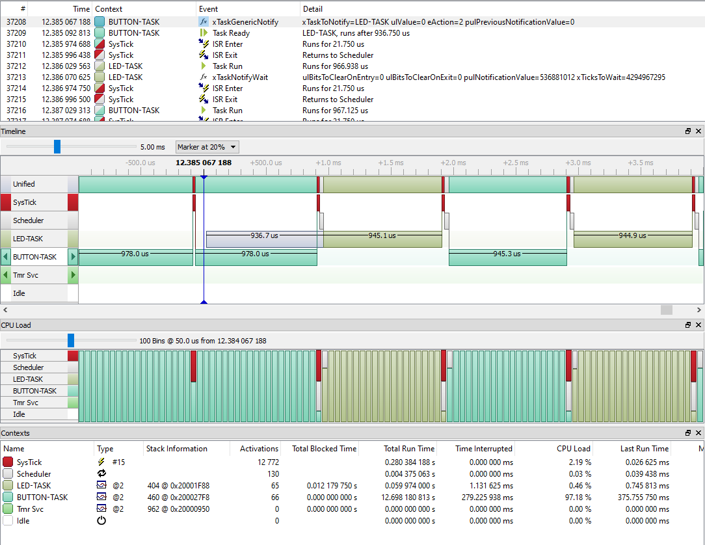

# Course: Mastering RTOS: Hands on FreeRTOS and STM32Fx with Debugging

Notes and Code Author: Leandro D. Medus  
August 2021

## Ch16. FreeRTOS Task Notification

### 16.1. Task Notify Introduction with exercise

#### Exercise

Write a program which creates 2 tasks **task_led** and **task_button** with equal priorities.

When button is pressed, task_button should notify the task_led and task_led should run on the CPU to toggle the LED. Also task_led should print how many times user has pressed the button so far.

**task_led** should not unnecessarily run on the CPU and it should be in Block mode until it receives the notification from the task_button.

### 16.2. Task notification APIs and xTaskNotifyWait()

RTOS Task Notification

Each RTOS task has a 32-bit notification value which is initialised to zero when the RTOS task is created.

An RTOS task notification is an event sent directly to a task that can unblock the receiving task, and optionally update the receiving task's notification value in a number of different ways. For example, a notification may overwrite the receiving task's notification value, or set one or more bits in the receiving task's notification value.

#### Wait and Notify APls

* xTaskNotifyWait()
* xTaskNotify()

#### xTaskNotifyWait()

If a task calls **xTaskNotifyWait()**, then it waits with an optional timeout until it receives a notification from some other task or interrupt handler.

task.c
```c
/* @param ulBitsToClearOnEntry Bits that are set in ulBitsToClearOnEntry value
 * will be cleared in the calling task's notification value before the task
 * checks to see if any notifications are pending, and optionally blocks if no
 * notifications are pending.  Setting ulBitsToClearOnEntry to ULONG_MAX (if
 * limits.h is included) or 0xffffffffUL (if limits.h is not included) will have
 * the effect of resetting the task's notification value to 0.  Setting
 * ulBitsToClearOnEntry to 0 will leave the task's notification value unchanged.
 *
 * @param ulBitsToClearOnExit If a notification is pending or received before
 * the calling task exits the xTaskNotifyWait() function then the task's
 * notification value (see the xTaskNotify() API function) is passed out using
 * the pulNotificationValue parameter.  Then any bits that are set in
 * ulBitsToClearOnExit will be cleared in the task's notification value (note
 * *pulNotificationValue is set before any bits are cleared).  Setting
 * ulBitsToClearOnExit to ULONG_MAX (if limits.h is included) or 0xffffffffUL
 * (if limits.h is not included) will have the effect of resetting the task's
 * notification value to 0 before the function exits.  Setting
 * ulBitsToClearOnExit to 0 will leave the task's notification value unchanged
 * when the function exits (in which case the value passed out in
 * pulNotificationValue will match the task's notification value).
 *
 * @param pulNotificationValue Used to pass the task's notification value out
 * of the function.  Note the value passed out will not be effected by the
 * clearing of any bits caused by ulBitsToClearOnExit being non-zero.
 *
 * @param xTicksToWait The maximum amount of time that the task should wait in
 * the Blocked state for a notification to be received, should a notification
 * not already be pending when xTaskNotifyWait() was called.  The task
 * will not consume any processing time while it is in the Blocked state.  This
 * is specified in kernel ticks, the macro pdMS_TO_TICSK( value_in_ms ) can be
 * used to convert a time specified in milliseconds to a time specified in
 * ticks.
 *
 * @return If a notification was received (including notifications that were
 * already pending when xTaskNotifyWait was called) then pdPASS is
 * returned.  Otherwise pdFAIL is returned.
 */
BaseType_t xTaskNotifyWait( 
    uint32_t ulBitsToClearOnEntry, 
    uint32_t ulBitsToClearOnExit, 
    uint32_t *pulNotificationValue, 
    TickType_t xTicksToWait );
```

*This explanation is taken from https://www.freertos.org/xTaskNotifyWait.html

xTaskNotifyWait() Return value:
* **pdTRUE** if a notification was received, or a notification was already pending when xTaskNotifyWait() was called.
* **pdFALSE** if the call to xTaskNotifyWait() timed out before a notification was received.

#### xTaskNotify()

**xTaskNotify()** is used to send an event directly to and potentially unblock an RTOS task, and optionally update the receiving task's notification value in one of the following ways:

* Write a 32-bit number to the notification value
* Add one (increment) the notification value
* Set one or more bits in the notification value
* Leave the notification value unchanged

This function must not be called from an interrupt service routine (ISR). Use xTask Notify From ISR() instead.

```c

/**
 * task. h
 * <PRE>BaseType_t xTaskNotify( TaskHandle_t xTaskToNotify, uint32_t ulValue, eNotifyAction eAction );</PRE>
 *
 * configUSE_TASK_NOTIFICATIONS must be undefined or defined as 1 for this
 * function to be available.
 *
 * When configUSE_TASK_NOTIFICATIONS is set to one each task has its own private
 * "notification value", which is a 32-bit unsigned integer (uint32_t).
 *
 * Events can be sent to a task using an intermediary object.  Examples of such
 * objects are queues, semaphores, mutexes and event groups.  Task notifications
 * are a method of sending an event directly to a task without the need for such
 * an intermediary object.
 *
 * A notification sent to a task can optionally perform an action, such as
 * update, overwrite or increment the task's notification value.  In that way
 * task notifications can be used to send data to a task, or be used as light
 * weight and fast binary or counting semaphores.
 *
 * A notification sent to a task will remain pending until it is cleared by the
 * task calling xTaskNotifyWait() or ulTaskNotifyTake().  If the task was
 * already in the Blocked state to wait for a notification when the notification
 * arrives then the task will automatically be removed from the Blocked state
 * (unblocked) and the notification cleared.
 *
 * A task can use xTaskNotifyWait() to [optionally] block to wait for a
 * notification to be pending, or ulTaskNotifyTake() to [optionally] block
 * to wait for its notification value to have a non-zero value.  The task does
 * not consume any CPU time while it is in the Blocked state.
 *
 * See http://www.FreeRTOS.org/RTOS-task-notifications.html for details.
 *
 * @param xTaskToNotify The handle of the task being notified.  The handle to a
 * task can be returned from the xTaskCreate() API function used to create the
 * task, and the handle of the currently running task can be obtained by calling
 * xTaskGetCurrentTaskHandle().
 *
 * @param ulValue Data that can be sent with the notification.  How the data is
 * used depends on the value of the eAction parameter.
 *
 * @param eAction Specifies how the notification updates the task's notification
 * value, if at all.  Valid values for eAction are as follows:
 *
 * eSetBits -
 * The task's notification value is bitwise ORed with ulValue.  xTaskNofify()
 * always returns pdPASS in this case.
 *
 * eIncrement -
 * The task's notification value is incremented.  ulValue is not used and
 * xTaskNotify() always returns pdPASS in this case.
 *
 * eSetValueWithOverwrite -
 * The task's notification value is set to the value of ulValue, even if the
 * task being notified had not yet processed the previous notification (the
 * task already had a notification pending).  xTaskNotify() always returns
 * pdPASS in this case.
 *
 * eSetValueWithoutOverwrite -
 * If the task being notified did not already have a notification pending then
 * the task's notification value is set to ulValue and xTaskNotify() will
 * return pdPASS.  If the task being notified already had a notification
 * pending then no action is performed and pdFAIL is returned.
 *
 * eNoAction -
 * The task receives a notification without its notification value being
 * updated.  ulValue is not used and xTaskNotify() always returns pdPASS in
 * this case.
 *
 *  pulPreviousNotificationValue -
 *  Can be used to pass out the subject task's notification value before any
 *  bits are modified by the notify function.
 *
 * @return Dependent on the value of eAction.  See the description of the
 * eAction parameter.
 *
 * \defgroup xTaskNotify xTaskNotify
 * \ingroup TaskNotifications
 */
BaseType_t xTaskGenericNotify( 
                TaskHandle_t    xTaskToNotify, 
                uint32_t        ulValue, 
                eNotifyAction   eAction, 
                uint32_t *      pulPreviousNotificationValue ) PRIVILEGED_FUNCTION;

#define xTaskNotify(        \
            xTaskToNotify,  \
            ulValue,        \
            eAction )       \
                            \
    xTaskGenericNotify(     \
        ( xTaskToNotify ),  \
        ( ulValue ),        \
        ( eAction ),        \
        NULL )
```

### 16.3. using xTaskNotifyWait() in the code


Now we have started using FreeRTOS APls from the task handlers. So they will consume more stack memory. so its better to increase the task's private stack . There is no formula to calculate how much stack should be allocated. let's use 
```c
    configMINIMAL_STACK_SIZE                 ((uint16_t)512)
```

512 words * 4 = 2048 bytes = 2Kib 

### 16.4. Task notifications  xTaskNotify()

### 16.5. Understanding Task notification trace


After the API call, the notification reaches the task, and the LED-TASK is put in **Ready Queue** (also called **Ready List**). The task changes its state from blocked to ready (not running but ready to run), and after that, the task will be in the ready list until the next **systick trigger**.

Since the SysTick realizes a task in the ready queue, it calls the scheduler for a context switch.

Trace of the app:




