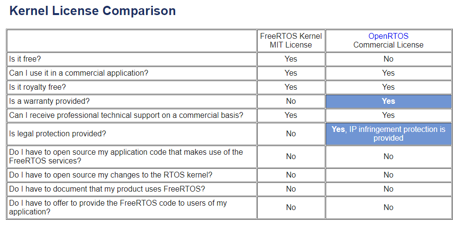

# Course: Mastering RTOS: Hands on FreeRTOS and STM32Fx with Debugging

Notes and Code Author: Leandro D. Medus  
August 2021

## Ch17. FreeRTOS Licensing model and API interface

### 17.1. freertos-licensing

Some characteristics:

* FreeRTOS is Free
* You can use it in your commercial applications.
* No need to give any royalty to freertos.org 
* Its based on GNU GPL license and you should make open your code changes made to FreeRTOS kernel.
* You need not to open source your applications Written using freeRTOS API
* Does it pass any safety standard? No it doesn't. Is it safe to use freeRTOS in Safety critical applications? No.
* Does freertos.org provide any legal protection ? No it doesn't. 
* Does freeRTOS.org provides any technical support? No it doesn't.

#### FreeRTOS: Commercial licensing

If you want: 
* Legal Support
* Technical Support during your Product development. 
Ensure meeting safety standard. Then you have to go for Commercial Licensing of freertos.org

* **SAFERTOS** is a derivative version of FreeRTOS that has been analyzed, documented and tested to meet the stringent requirements of the **IEC 61508 safety standard**. This RTOS is audited to verify **IEC 61508 SIL 3** conformance.

* **OpenRTOS** is a commercially licensed version of FreeRTOS. The OpenRTOS license does not contain any references to the GPL.

source: [https://www.freertos.org/openrtos.html](https://www.freertos.org/openrtos.html)

### 17.2. FreeRTOS API Interface

