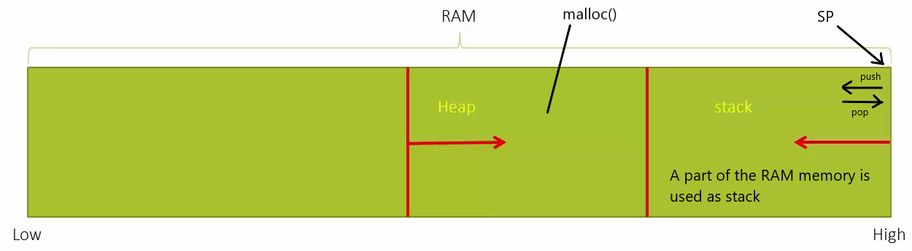
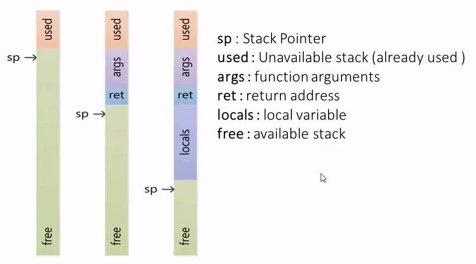
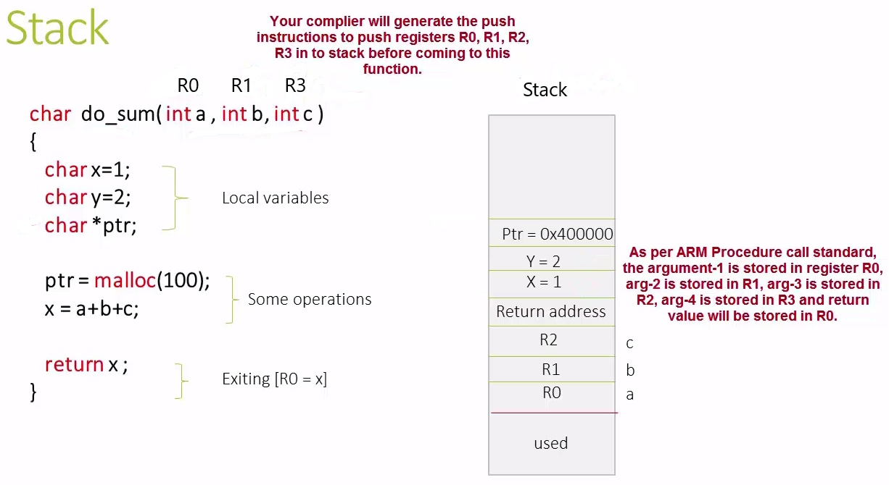
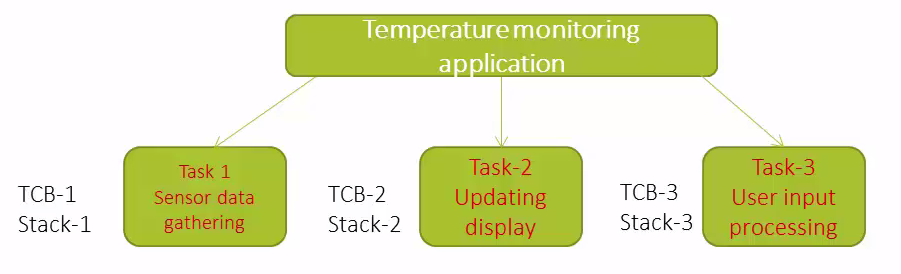
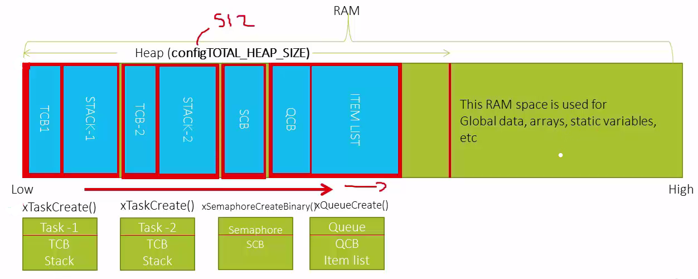
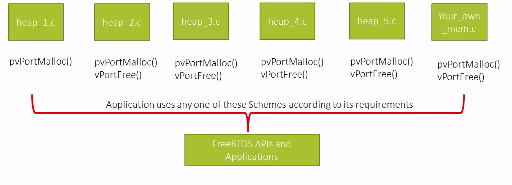
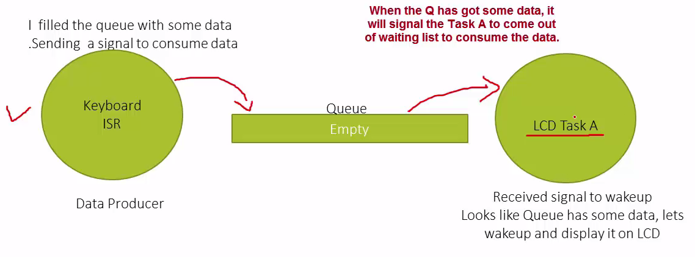
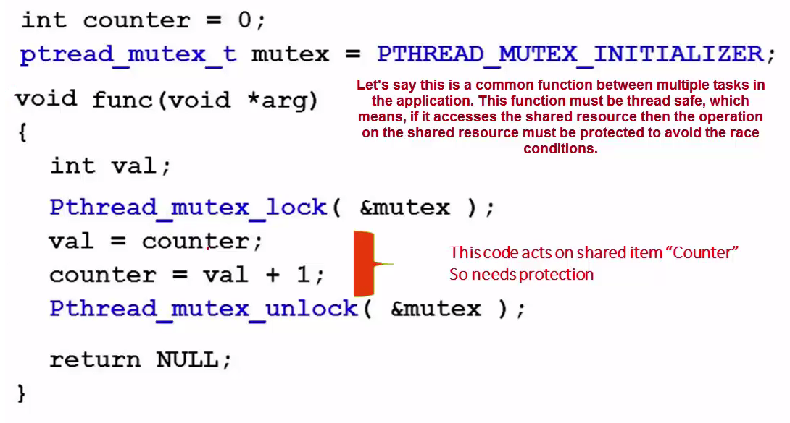

# Course: Mastering RTOS: Hands on FreeRTOS and STM32Fx with Debugging

Notes and Code Author: Leandro D. Medus  
August 2021

## Ch18. Overview of FreeRTOS Memory manage, STACK and Synchronization services

### 18.1. Overview of FreeRTOS Memory Management

#### RAM and Flash

**RAM**
1. To store your application data like global arrays, global variables, etc
2. You can download code to RAM and Run (e.g patches)
3. A part of RAM is used as STACK to store local variables, function arguments, return address, etc
4. A part of RAM is used as HEAP for dynamic memory allocations

**FLASH**

1. Flash is used to hold your application code
2. Flash also holds constants like string initialization
3. Flash holds the vector table for interrupts and exceptions of the MCU

#### Stack and heap memory 

* malloc() just returns the memory pointer from heap
* heap is used for dynamic allocation of memory to application during run time 
* push and pop operation works on the stack
* SP (stack pointer of the MCU) is usually initialized to the highest memory address of the RAM (begining of the stack)

#### Stack

* Order in stack: FILO (first in last out)
* Order in heap: without order

Whenever a function call is made, in the stack will be allocated
1.1. arguments of the function
1.2. return address
Then is local variables are used, more space will be allocated in the stack

#### Heap

Heap is a general term used for any memory that is allocated dynamically and randomly.

Whereas stack is managed by SP and dedicated instructions like PUSH and POP, the **heap** management is up to the environment. C uses **malloc** and C++ uses **new**.

**Note**: for embedded systems, malloc and free APIs are not suitable because:
* they eat up large code space, 
* lack of deterministic  nature, and
* fragmented over time as blocks of memory are allocated 

### 18.2. FreeRTOS Heap and Stack Management

#### Where do you think task's TCB and its associated stack will be created?

There are 2 options:
1. if you use dynamic creation method then they will be created in the heap memory of the RAM 
2. if you create them statically then they will be created in other part of the RAM except heap and stack space

For this example:
* each task will have its own task space. 
* The size of the stack have to be mention during creation of the task

#### Who decides the starting address and size of the heap?

* By default the **FreeRTOS heap** is declared by FreeRTOS kernel
* Setting **configAPPLICATION_ALLOCATED_HEAP** to **1** allows the heap to instead be declared by the application.

When you create a task dynamically, a TCB and associated stack will be created in the heap space of the RAM.

#### FreeRTOS Heap management schemes 

  

### 18.3. Overview of FreeRTOS Synchronization and mutual exclusion Services

#### How to achieve this signaling?

* Events (or Event Flags)
* Semaphores (Counting and binary)
* Queues and Message Queues
* Pipes
* Mailboxes
* Signals (UNIX like signals)
* Mutex

All these software subsystems support signaling hence can be used in Synchronization purposes.

#### Mutual Exclusion Services of FreeRTOS

**Mutual exclusion**  
means that only a single thread should be able to access the shared resource at any given point of time. This avoids the race conditions between threads acquiring the resource. Usually you have to lock that resource before using and unlock it after you finish accessing the resource.

**Synchronization**  
means that you synchronize/order the access of multiple threads to the shared resource.

**Mutual Exclusion can be achived with:**
* mutex
* semaphore