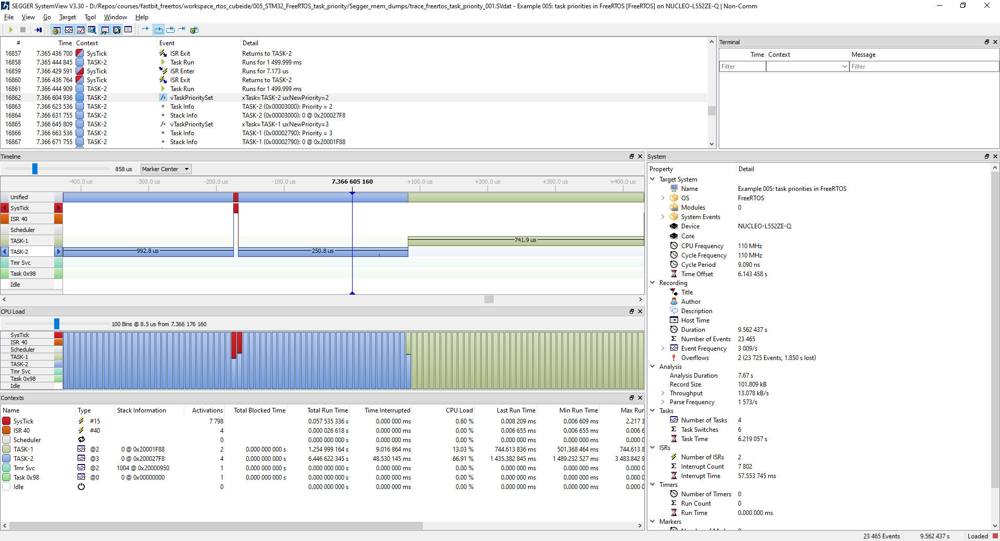
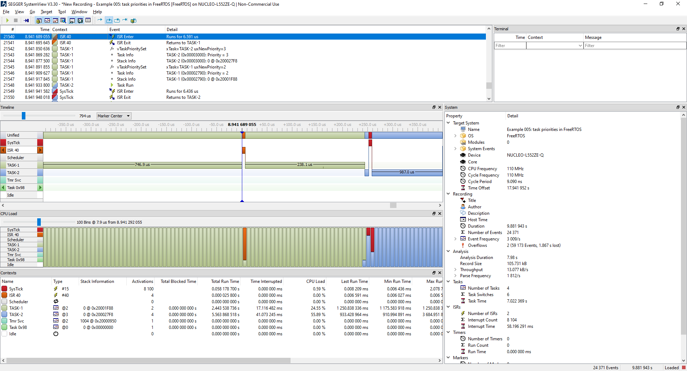

# Course: Mastering RTOS: Hands on FreeRTOS and STM32Fx with Debugging

Notes and Code Author: Leandro D. Medus  
August 2021

## Ch21. ARM Cortex M Interrupt Priority and  FreeRTOS Task Priority

### 21.1. FreeRTOS Hardware interrupt Configurable items

* ConfigKERNEL_INTERRUPT_PRIORITY 
* configMAX_SYSCALL_INTERRUPT_PRIORITY

### 21.2. FreeRTOS Hardware interrupt Co nfigurable items contd.

### 21.3. Priority of freeRTOS Tasks

### 21.4. FreeRTOS priority SetGet APIs

### 21.5. Exercise  Task Priority

### 21.6. Exercise  Task Priority Implementation and testing

### 21.7. Exercise  Task Priority analyzing the trace

