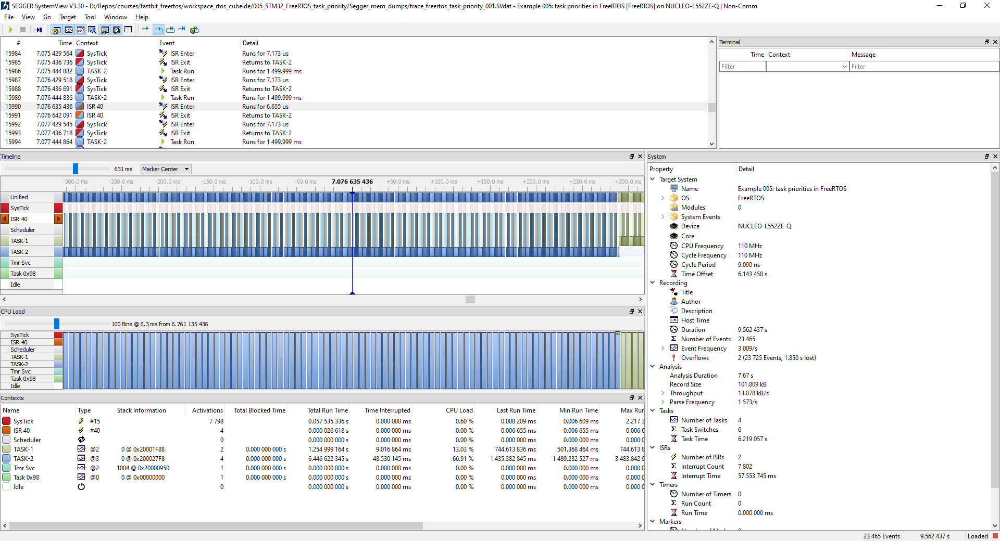

# Course: Mastering RTOS: Hands on FreeRTOS and STM32Fx with Debugging

Notes and Code Author: Leandro D. Medus  
August 2021

## Ch21. ARM Cortex M Interrupt Priority and  FreeRTOS Task Priority

### 21.1. FreeRTOS Hardware interrupt Configurable items

* ConfigKERNEL_INTERRUPT_PRIORITY 
* configMAX_SYSCALL_INTERRUPT_PRIORITY

### 21.2. FreeRTOS Hardware interrupt Co nfigurable items contd.

### 21.3. Priority of freeRTOS Tasks

### 21.4. FreeRTOS priority SetGet APIs

### 21.5. Exercise  Task Priority

### 21.6. Exercise  Task Priority Implementation and testing

### 21.7. Exercise  Task Priority analyzing the trace

The following image depicts that the context switch happened after 100 us (or less) from the priority change event. 

The main problem is the delay time between the interrupt and the context switch. In this case, this delay is between 300 ms and 500 ms due to how the application is coded.

Esto se puede ver dado que que si la verificación del flag del cambio de prioridad se hace a intervalos determinado por los delay que corren como dummy en el procesador, esto afectará el tiempo de muestreo.

Una modificación no óptima pero efectiva, solo a efectos de mantener la prueba de concepto es en los delays, hacer la verificación del flag del cambio de prioridades. Así se puede observar que entre la ISR y el cambio de tarea pasan menos de 250 us.

