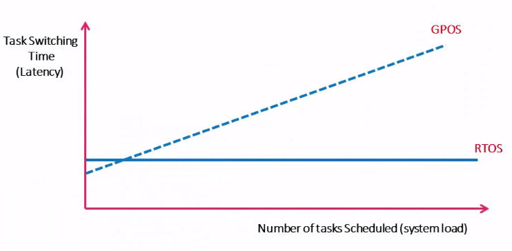
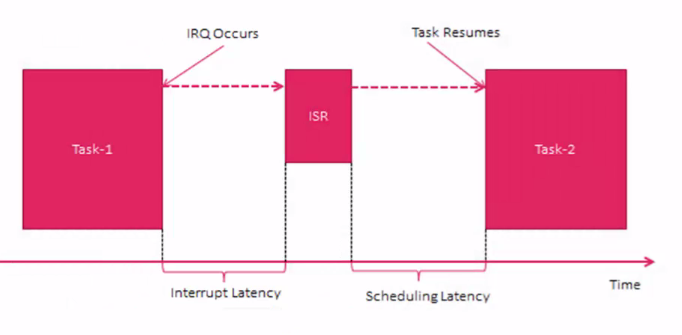

# Course: Mastering RTOS: Hands on FreeRTOS and STM32Fx with Debugging

Notes and Code Author: Leandro D. Medus  
August 2021

## Ch2. RTOS Introduction
Real time computing is equivalent to predictable computing

In real time computing timeless is more important than performance

"real-time" deals with guarantees, not with raw speed

A RT system is one in which the correctness of the computations not only depends upon the logical correctness of the computation,  but also upon the time at which the reusult is produced. If the timing constrainsts are not met, system failure is said to have ocurred.

### 2.1. Real time applications (RTAs)?

* RTAS are not fast executing applications.
* RTAS are **time deterministic applications**, that means, their response time to events is almost constant.
* There could be small deviation in RTAS response time, in terms of ms or seconds which will fall into the category of soft real time applications.
* Hard real time functions **must complete within a given time limit failure** to do so will result in absolute failure of the system.

### 2.2. Real time operation system (RTOS)

It's a OS, specially designed to run applications with very precise timing and a high degree of reliability.

To be considered as "real-time", an operating system must have a known maximum time for each of the critical operations that it performs. Some of these operations include
* Handling of interrupts and internal system exceptions
* Handling of Critical Sections.
* Scheduling Mechanism, etc.

**Note**: 
* **GPOS** general purpose OS: linux, w10, iOS, android
* **RTOS** real time OS: VxWorks, QNX, freeRTOS, Integrity

### 2.3. RTOS vs GPOS: Task Scheduling

#### GPOS -Task Scheduling

GPOS is programmed to handle scheduling in such a way that it manages to achieve high throughput.

**Throughput** means - the **total number of processes that complete their execution per unit time**.

Some times execution of a high priority process will get delayed in order to serve 5 or 6 low priority tasks. High throughput is achieved by serving 5 low priority tasks than by serving a single high priority one.

So, if 5 or 6 low priority Applications are waiting to run, then the GPOS may delay 1 or 2 high Priority task in order to increase the throughput

In a GPOS, the scheduler typically uses a fairness policy to dispatch threads and processes onto the CPU.

Such a policy enables the high overall throughput required by desktop and server applications, but offers no guarantees that high-priority, time critical threads or processes will execute in preference to lower-priority threads.

#### RTOS - Task Scheduling

On the other hand in RTOS, Threads execute in the order of their priority. If a high-priority thread becomes ready to run, it will take over the CPU from any lower-priority thread that may be executing. 

Here a high priority thread gets executed over the low priority ones. All "low priority thread execution" will get paused. A high priority thread execution will get override only if a request comes from an even high priority threads.

#### RTOS vs GPOS: Task Scheduling

RTOS may yield less throughput than the General Purpose OS, because it always favors the high Priority task to execute first, but that does not mean, it has very poor throughput.

A Quality RTOS will still deliver decent overall throughput but can sacrifice throughput for being deterministic or to achieve time predictability.

**Summary:**
* GPOS: Meet Higher Throughput
* RTOS: Meet Time Predictability

For the RTOS, achieving predictability or time deterministic nature is more important than throughput, but for the GPOS achieving higher throughput for user convenience is more important.

### 2.4. RTOS vs GPOS: Latency

#### RTOS vs GPOS: Task Switching Latency

In Computing, Latency means "The time that elapses between a stimulus and the response to it".

Task switching latency means, that time gap between "A triggering of an event and the time at which the task which takes care of that event is allowed to run on the CPU"

In the case of RTOS the task switching latency is always time bounded and doesn't vary significantly.

#### RTOS vs GPOS: interrupt latency

The scheduling latency is the time taken for context switching operation.

**Both the interrupt latency and scheduling latency of the RTOS is as small as possible and time bounded**. But in the case of GPOS, due to increase in system load these parameters may vary significantly.

### 2.5. RTOS vs GPOS: Priority inversion

LP (low priority) Task has acquired the shared resource now by using the key, But it is not getting chance to run on the CPU to give up the key. That means the shared resource is locked by LP task indefinitely which is also required by HP (high priority) Task to proceed.

So, the HP  Task has to wait until LP task runs on the CPU. That is nothing but the situation of the "Priority Inversion". HP Task is forced to behave like LP Task.

#### What are the features that a RTOS has but a GPOS doesn't ?

1. Priority based preemptive scheduling mechanism
2. No or very short Critical sections which disables the preemption
3. Priority inversion avoidance (multiple techniques)
4. Bounded Interrupt latency
5. Bounded Scheduling latency, etc.

### 2.6. Multitasking

A task is nothing but, just a piece of code which can be schedulable on the CPU to execute.

Running multiple task on a processor is accomplished by the scheduler
