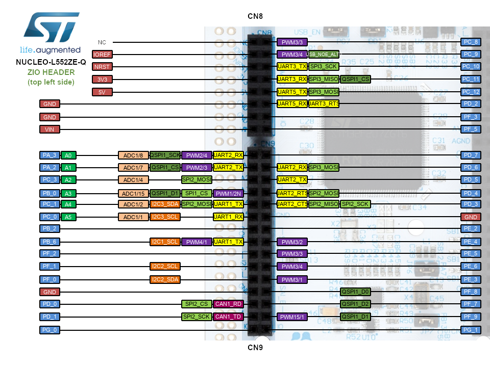
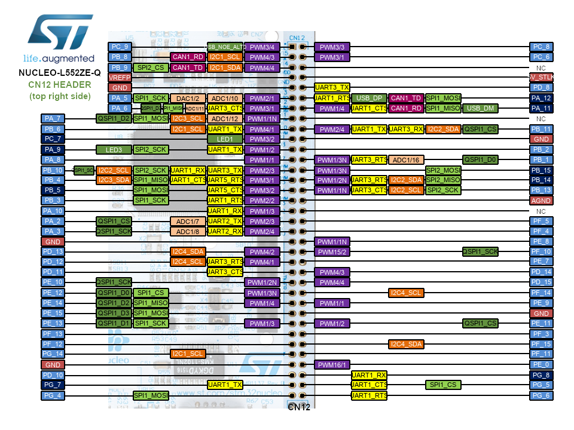
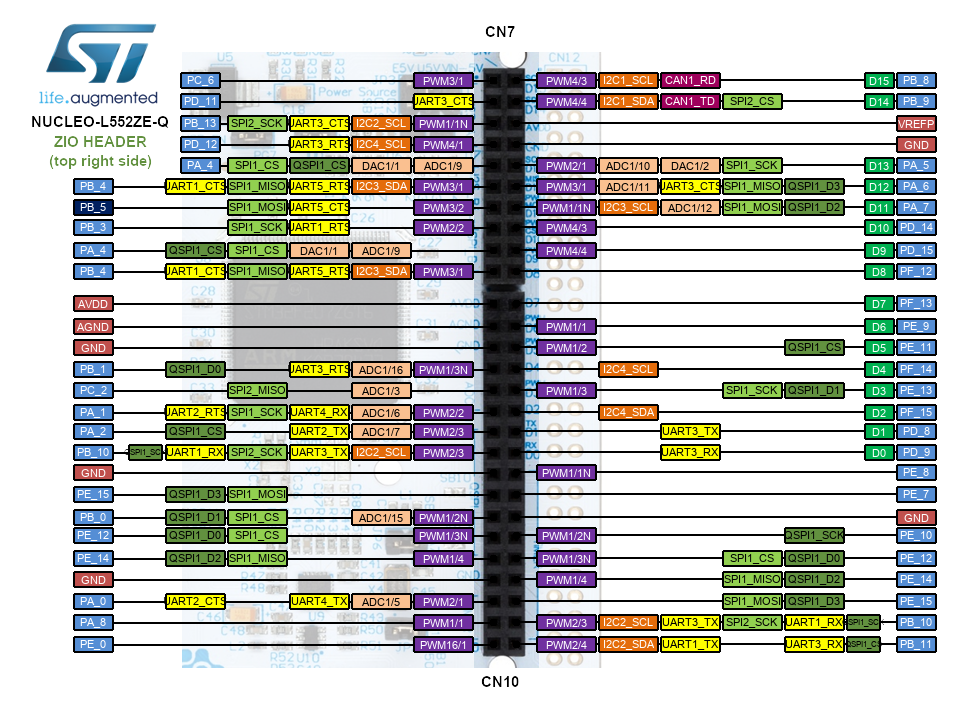

# Course: Mastering RTOS: Hands on FreeRTOS and STM32Fx with Debugging

Notes and Code Author: Leandro D. Medus  
August 2021

## Ch3. Development board used in the course

Driver: STSW-LINK009  
ST-LINK, ST-LINK/V2, ST-LINK/V2-1, STLINK-V3 USB driver signed for Windows7, Windows8, Windows10

### Board 

#### Description

NUCLEO-L552ZE-Q

STM32 Nucleo-144 development board with STM32L552ZE MCU, SMPS, supports Arduino, ST Zio and morpho connectivity

The STM32L552xx devices are an ultra-low-power microcontrollers family (STM32L5 Series) based on the high-performance Arm® Cortex®-M33 32-bit RISC core. They operate at a frequency of up to 110 MHz.

Board features
* STM32 microcontroller in LQFP144 package
* 3 user LEDs
* 2 user and reset push-buttons
* 32.768 kHz crystal oscillator
* Board connectors:
    * ST Zio expansion connector including ARDUINO® Uno V3
    * ST morpho expansion connector
* Flexible power-supply options: ST-LINK, USB VBUS or external sources
* On-board ST-LINK debugger/programmer with USB re-enumeration capability: mass storage, Virtual COM port and debug port

#### pinout

**Pins Legend** 

