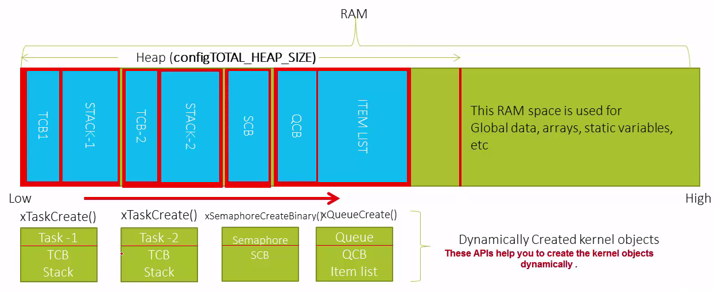

# Course: Mastering RTOS: Hands on FreeRTOS and STM32Fx with Debugging

Notes and Code Author: Leandro D. Medus  
August 2021

## Ch7. FreeRTOS Task Creation

### 7.1

Each task has inside a infinite loop, if in any case the program reach the end of the function, the task has to be deleted with:

```c
vTaskDelete ( NULL)
```

> Each instance of a task created using the given task handler will have its own copy of the variable. This will be not true if the variable is declared static, and that varible will be shared for each instance of the task.

variables of the task handler will be created in the **stack**.

If 2 different tasks used the same task handler (function) as the common task function, then there will be 2 separate copies of the local variable and each one will be created in ther respective task space.

If the variable is declared as static it will be treated as a single global variable that will be common between task1 and task2, for instance.

### 7.2. Task Create API

xTaskCreate 

```c
BaseType_t xTaskCreate(	TaskFunction_t pxTaskCode,
                        const char * const pcName,
                        const configSTACK_DEPTH_TYPE usStackDepth,
                        void * const pvParameters,
                        UBaseType_t uxPriority,
                        TaskHandle_t * const pxCreatedTask )
```

* pxTaskCode: name of the "task function"
* pcName: descriptive name. (Could be NULL)
* usStackDepth: stack space. Task function will use this associated stack space of the task to create the local variables and to save the context of the task during context switch
* pvParameters: pointer as an argument to the funtion to send data to the function. (Could be NULL)
* uxPriority: priority of the task
* handler to the TCB (task controller block) - handler of a task

This api will create a TCB (Task Control block ) for the task and associated Stack space in the memory.


Priority:


### 7.4. FreeRTOS behind the scene Task Management

When a task is created

the configTOTAL_HEAP_SIZE is the total space reserved in RAM to allocate a each task. The rest of the ram can be used fot global data, arrays, static variables.

When a task is created with xTaskCreate, the API dinamically allocates memory for the task control block and for the stack, for instance task1
* task1
    * TCB
    * Stack

if the stack is 512 words = 512 * 4 bytes (32 bits) = memory required i nthe heap memory.




