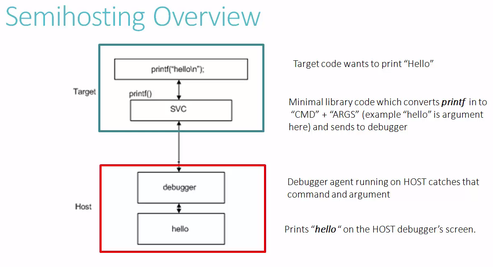
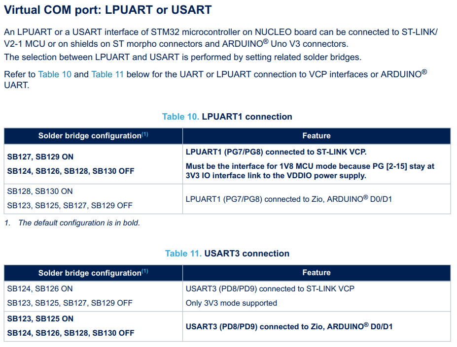

# Course: Mastering RTOS: Hands on FreeRTOS and STM32Fx with Debugging

Notes and Code Author: Leandro D. Medus  
August 2021

## Ch9. Semi hosting and UART setup




### 8.2 Using semihosting 


1. Linker argument settings
> C and C++ build > linker > misc 
> -specs=rdimon.specs -lc -lrdimon

2. Debug configuration of your application 
Debug as > debug configuration > select the project > tab: Startup > Run command: 
> monitor arm semihosting enable

3. in main.c use below codes
```c
extern void initialise_monitor_handles();
```

4. in main function
```c
#ifdef USE_SEMIHOSTING
    initialise_monitor_handle();
    printf("Message in debug mode with semihosting");
#endif
``` 

### 8.3 Using the UART 

Here is important to understand which UART is configured by default. From the UM2581 - User manual - STM32L5 Nucleo-144 board (MB1361) - section 6.1




From the figure the important thing is:

> LPUART1 (PG7/PG8) connected to ST-LINK VCP.  
Must be the interface for 1V8 MCU mode because PG [2-15] stay at 3V3 IO interface link to the VDDIO power supply.

So:
* PG7
    * type: LPUART1_TX
    * default name: ST-LINK_VCP_TX
* PG8: 
    * type: LPUART1_RX
    * default name: ST-LINK_VCP_RX

**Another important thing here is that for the current board (NULEO-L552), the LPUART1 is connected to the VCP UART (Embedded ST-LINK/V2), and the USART3 is connected to the ARDUINO D0/D1 connector. This default configuration only depends on the SBx connections (soldering bridges) in the board.**

In the new STM32CubeIDE the code structure is realy hihg level since in the main.c file you are going to find only calls to functions and macros. This is suitable since the MX tool manages the comple HAL. The only problem could be that in future versions the current code will no be compatible... (as always) but it really depends on the manufacturer.


#### UART MX Configuration

Mode: asynchronous
HW flow control: disable

baud rate: 209700

If this have to be done manually, in NUCLEO-L5 we have:
> LPUART1 (PG7/PG8) connected to ST-LINK VCP.

in the datasheet of the chip 
* Section: 4 Pinouts and pin description
    * Table 22. Alternate function AF0 to AF7 (continued)

So in the datasheet the alternative functions are divided in two tables:
* alternative functions from AF0 to AF7
* alternative functions from AF8 to AF15

So to find the PG7 you need to check both tables. You can find the uart function int the second one under funtion **AF8** on **page 136**. So:
* LPUART1_TX (Port G, pin 7): AF8 
* LPUART1_RX (Port G, pin 8): AF8 


### 4. UART pin configuration using STD. Periph. Libray APIs

Course example:
```c
static void pvrSetupHardware(void)
{
    GPIO_InitTypeDef gpio_uart_pins;
    USART_InitTypeDef uart2_init;

    GPIO InitTypedef gpio uart_pins;

    //1. Enable the UARTZ and GPIOA Peripheral clock
    RCC_APB1PeriphClockCmd (RCC_APB1Periph_USART2, ENABLE); 
    RCC_AHB1PeriphClockCmd (RCC_AHB1Periph_GPIDA, ENABLE);

    //PA2 is UART2_TX, PA3 is AURT2_RX

    //zeroing each and every member element of the structure
    memset(&gpio_uart_pins,0, sizeof(gpio_uart_pins));

    //2. Alternate function configuration of MCU mins to beltage as UARTZ TX and RX
    gpio_uart_pins.GPIO_Pin = GPIO_Pin_2 | GPIO_Pin_3;
    gpio_uart_pins.GPIO_Mode = GPIO_Mode_AF;
    gpio_uart_pins.GPIO_PuPd = GPIO_PuPd_UP;
    
    GPIO_Init(GPIOA, &gpio_uart_mins);

    3. AF mode settings for the pins
    GPIO_PinAFConfig(GPIOA, GPIO_PinSource2, GPIO_AF_USART2); //PA2
    GPIO_PinAFConfig(GPIOA, GPIO_PinSource3, GPIO_AF_USART2); //PA3

    //4. UART parameter initializations

    //zeroing each and every member element of the structure
    memset(&uart2_init,0, sizeof(uart2_init));

    uart2_init.USART_BaudRate = 115200;
    uart2_init.USART_HardwareFlowControl = USART_Hardware_FlowControl_None; uart2_init.USART_Mode = USART_Mode_Tx | USART_ Mode_Rx;
    uart2_init.USART_Parity = USART_Parity_No;
    uart2_init.USART_StopBits = USART_StopBits_1; 
    uart2_init.USART_WordLength = USART_WordLength_8b; 
    USART_Init(USART2, &uart2_init);

    // 5. Enable the UART 2 peripheral 
    USART_Cmd((USART2, ENABLE);
}
```

### 6. Exercise  UART Printmsg implementation using std periph. libary

Some interesting aproach to print msgs.

```c

    char msg[100] = "[Test] -- sending a message --\r\n"
    char usr_msg[250];

   void printmsg(char *msg);

    void printmsg(char *msg)
    {
        for(i=0; i < strlen(msg); i++)
        {
            while(USART_GetFalgStatus(USART2, USART_FLAG_TXE) != SET);
            UART_SendData(USART2, msg[i]);
        }
    }
```

```c
   sprintf(usr_msg, "[Test] -- sending a message --\r\n");
```

#### new code for the current version

From *stm32l5xx.h*
```c
/** @addtogroup Exported_types
 * @{
 */
typedef enum
{
  RESET = 0,
  SET = !RESET
} FlagStatus, ITStatus;
```

From *stm32l5xx_hal_uart.h*

```c
#define UART_FLAG_TC                        USART_ISR_TC            /*!< UART transmission complete                */
```

Some useful methods from *stm32l5xx_hal_uart.h*:

```c
HAL_StatusTypeDef UART_WaitOnFlagUntilTimeout(UART_HandleTypeDef *huart, uint32_t Flag, FlagStatus Status,
                                              uint32_t Tickstart, uint32_t Timeout);


HAL_StatusTypeDef HAL_UART_Transmit(UART_HandleTypeDef *huart, uint8_t *pData, uint16_t Size, uint32_t Timeout);

HAL_StatusTypeDef HAL_UART_Receive(UART_HandleTypeDef *huart, uint8_t *pData, uint16_t Size, uint32_t Timeout);
```

How it is implemented in code:

**sprintf** as uaxiliary function:  
The C library function int sprintf(char *str, const char *format, ...) sends formatted output to a string pointed to, by str.
```c
int sprintf(char *str, const char *format, ...);
```

```c
// private variables
char usr_msg[250];
```

in main
```c
   sprintf(usr_msg, "[Test] -- sending a message --\r\n");
```

```c
       // sending a string
    HAL_UART_Transmit(&hlpuart1, (uint8_t *) usr_msg, strlen(usr_msg), 100);

    /* Init tickstart for timeout management */
    uint32_t tickstart = HAL_GetTick();
    // waiting for transmission to complete
    while(UART_WaitOnFlagUntilTimeout(&hlpuart1, UART_FLAG_TC, RESET, tickstart, HAL_UART_TIMEOUT_VALUE) != HAL_OK);

    HAL_UART_Transmit(&hlpuart1, (uint8_t *) "done\n\r", 6, 100);

```

#### Task implementation with the UART comm

```c
#define TRUE            1
#define FALSE           0
#define AVAILABLE       TRUE
#define NOT_AVAILABLE   FALSE
```

```c
/* USER CODE BEGIN PV */
uint8_t UART_ACCESS_KEY = AVAILABLE;
```

```c
static void task1_handler(void* parameters)
{

    char msg[100];

    while(1)
    {
        if(UART_ACCESS_KEY == AVAILABLE)
        {
            UART_ACCESS_KEY = NOT_AVAILABLE;
            snprintf(msg,100,"%s\n", (char*)parameters);
            // SEGGER_SYSVIEW_PrintfTarget(msg);

            sendString(msg);
            UART_ACCESS_KEY = AVAILABLE;
            taskYIELD();            // Macro for forcing a context switch
        }
    }
}

```